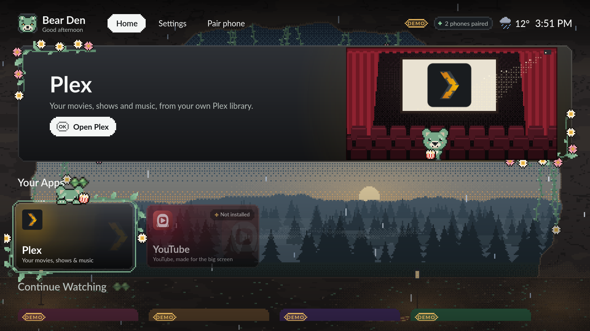
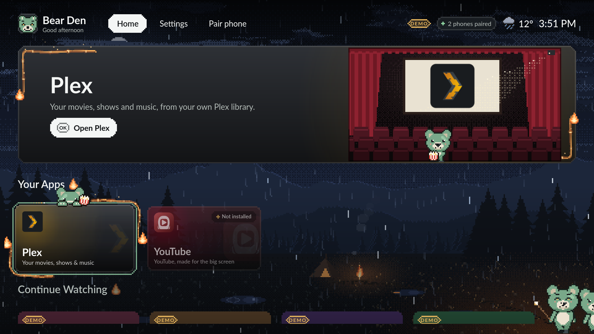
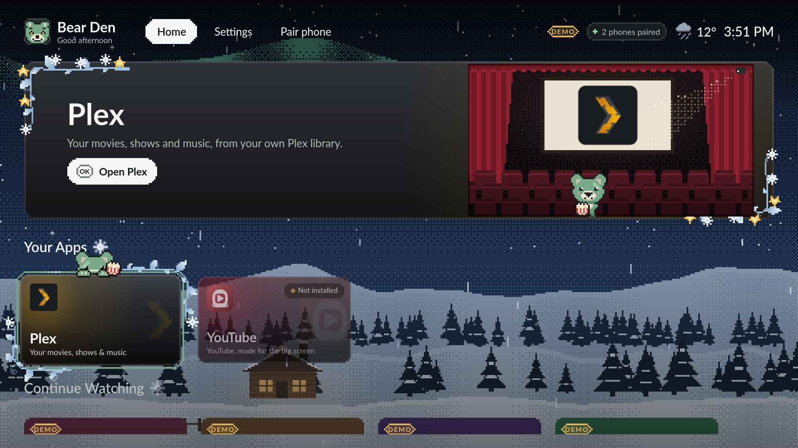
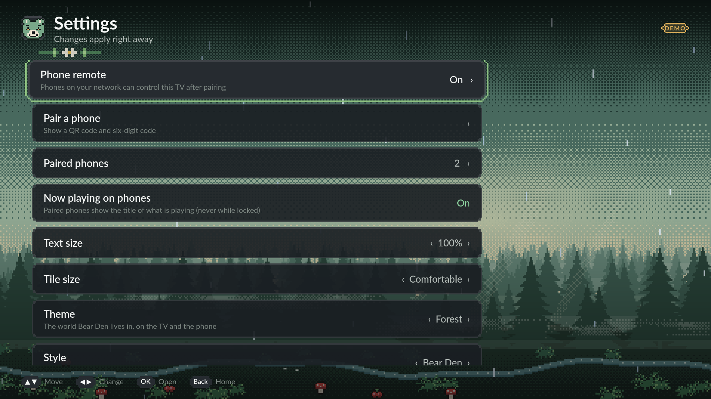

# Bear Den TV

[](https://github.com/itsgsimi/bear-den-tv/actions/workflows/ci.yml)

Bear Den TV turns a small Linux box into a TV that you drive with your phone.

- The TV shows a cosy home screen: your apps, big tiles, a pixel-art world and
  a few visiting bears.
- Your phone is the remote. You pair it once with a code on the TV.
- It opens **Plex HTPC**, **VacuumTube** (YouTube) and **Moonlight** (game
  streaming), and Home always brings you back.
- Those apps are ordinary Flatpaks. Bear Den launches them, brings them to the
  front and tunes their playback settings. It never wraps, embeds or patches
  them.



| | |
|---|---|
|  |  |
|  | Screenshots are rendered by the sandbox on demo data (the **DEMO** labels). The layout and colours match the TV. |

## Status: a working developer preview

It runs every day on one reference TV box. It is not a finished product. The
detailed, honest record is [`docs/IMPLEMENTATION_STATUS.md`](docs/IMPLEMENTATION_STATUS.md).

**Works, and has been seen on the reference TV:**

- The coordinator and home screen start at desktop login and restart after a crash.
- A phone pairs, then launches Plex HTPC, VacuumTube and Moonlight, sends keys,
  and returns Home with focus where you left it (end-to-end suite, 5/5).
- Everything is refused, with a reason, while the TV's desktop is locked.
- Deploying from a workstation with one script.
- Local weather fetched from Open-Meteo (the on-screen chip has not been checked
  by eye on the TV).

**Built and tested here, not yet seen on the TV:** some themes, bear visits and
corner scenes; the performance of several newer visuals.

**Not done yet:** Plex content rails from a real Plex server (the rails show
DEMO content in dev mode only), published release packages (the .deb below
builds and passes clean-container install tests but has not been installed on
the TV yet), and browser (Playwright) tests for the phone remote.

## What it needs

| | |
|---|---|
| **TV box** | Linux with an **X11** desktop session (the reference box runs Linux Mint 21.3 Xfce). Wayland is not supported. |
| **Hardware floor** | A Celeron 2955U: 2 cores at 1.4 GHz, Haswell GT1 graphics, 7.6 GiB RAM, driving 1080p at 120 Hz. Faster boxes get more, from measured capability ([`docs/APP_PERFORMANCE.md`](docs/APP_PERFORMANCE.md)). |
| **Apps** | Flatpak, plus any of Plex HTPC, VacuumTube and Moonlight. Missing apps show as "Not installed". |
| **Phone** | Any modern phone browser on the same network. No app to install. |
| **Workstation** | A Linux machine to build on. The toolchain installs in your home folder; no root needed. |

## Install

A `.deb` for Ubuntu 22.04 / Linux Mint 21.3 and newer (amd64, X11 desktop).
Download `bear-den-tv_<version>_amd64.deb` (and `SHA256SUMS`) from the
[Releases page](https://github.com/itsgsimi/bear-den-tv/releases); GitHub's runner builds and tests every
release ([Cutting a release](docs/operations.md#cutting-a-release)). No release
has been published yet; until then, build one yourself with the toolchain
below (`make package` → `build/dist/`) for your own use only.

On the TV box:

```sh
sha256sum -c --ignore-missing SHA256SUMS            # optional: check the download
sudo apt install ./bear-den-tv_<version>_amd64.deb  # Qt is bundled; X11/EGL/fonts come from the distro
/usr/lib/bear-den-tv/start-session.sh --watch       # start it now, or open "Bear Den TV" from the app menu
bear-den-tv autostart enable                        # optional: start at every desktop login
```

Installing enables nothing by itself; autostart is your choice. To remove it:

```sh
bear-den-tv autostart disable
sudo apt remove --purge bear-den-tv
```

Your settings and paired phones stay in `~/.config/bear-den-tv` and
`~/.local/share/bear-den-tv`; delete those to forget them. Details:
[`docs/operations.md` → Packaging](docs/operations.md#packaging).

## Quick start (on a workstation)

```sh
git clone <this repo> bear-den-tv && cd bear-den-tv
scripts/bootstrap-toolchain.sh      # once: Go, Qt 6.8, CMake, Node in ~/.bdtv-toolchain (no root)
. scripts/env.sh                    # every new shell: put the toolchain on PATH
make help                           # every make target
make test                           # Go (race), phone remote unit tests, shell tests (offscreen)
make dev DEV_ARGS=--dev-fixtures    # coordinator + home screen locally, fake desktop, DEMO data
```

Prototype the TV picture without a TV:

```sh
make shell                                                   # build the home screen
scripts/sandbox.sh shot --screen settings --theme forest     # one screenshot, prints its path
make shots                                                   # every theme × main screens in build/shots/gallery
```

## Run it on your TV

1. Copy [`target.env.example`](target.env.example) to `target.env` and set
   `BDTV_TARGET` to your TV's ssh address. `target.env` is untracked; never
   commit it.
2. Bootstrap the toolchain on the TV too (the home screen uses its Qt
   libraries): `scripts/target.sh run scripts/bootstrap-toolchain.sh`.
   The deploy script builds the TV shell to load Qt from the TV's own
   `~/.bdtv-toolchain`. If you bootstrapped it somewhere else on the TV, set
   `BDTV_TARGET_TOOLCHAIN` in `target.env`.
3. Deploy from the workstation: `scripts/deploy-target.sh` (try `--dry-run` first).
4. On the TV, start it once and turn on autostart:
   `scripts/start-session.sh --watch`, then `build/bin/bear-den-tv autostart enable`.
5. On the TV: **Settings → Phone remote**. Pick the network interface and agree
   to open it on your LAN. Nothing listens on the network before this.
6. **Pair phone** on the TV shows a QR code and a six-digit code. Open it on
   your phone.

The full, current commands are in [`docs/operations.md`](docs/operations.md).

## Make it yours

A theme is a package: a `theme.json` plus art, no code. Five ship built in
(Den, Forest, Campfire, Winter, Midnight). Your own go in
`~/.local/share/bear-den-tv/themes/` and appear without a rebuild. The bears
are the cast of the default style; **Settings → Style → Plain** turns them off.
Start with [`docs/THEMES.md`](docs/THEMES.md).

## Repository map

| Part | Where | Owns | Guide |
|---|---|---|---|
| **Coordinator** (Go) | `cmd/`, `internal/` | the session: which app is in front, launching and closing apps, routing input, pairing and permissions, configuration, the LAN service, playback tuning | [`internal/AGENTS.md`](internal/AGENTS.md) |
| **TV shell** (Qt 6.8 QML/C++) | `apps/tv-shell/` | everything on the TV between apps: focus, screens, themes, bears | [`apps/tv-shell/AGENTS.md`](apps/tv-shell/AGENTS.md) |
| **Phone remote** (TypeScript, Preact) | `apps/remote-web/` | the phone UI, served by (and embedded in) the coordinator | [`apps/remote-web/AGENTS.md`](apps/remote-web/AGENTS.md) |
| **Contracts** | `contracts/` | JSON Schemas, specs and fixtures, validated in all three languages | [`contracts/AGENTS.md`](contracts/AGENTS.md) |
| **Themes** | `themes/` | theme packages (manifest + art, no code) | [`themes/AGENTS.md`](themes/AGENTS.md) |
| **Scripts** | `scripts/` | toolchain, sandbox, deploy, TV helpers | [`docs/operations.md`](docs/operations.md) |

## Docs map

| Question | Read |
|---|---|
| How does it all work? | [`docs/HOW_IT_WORKS.md`](docs/HOW_IT_WORKS.md) |
| What does this word mean? | [`docs/GLOSSARY.md`](docs/GLOSSARY.md) |
| Everyday commands, deploying, the TV | [`docs/operations.md`](docs/operations.md) |
| Themes and bears | [`docs/THEMES.md`](docs/THEMES.md) |
| App playback settings, box tiers | [`docs/APP_PERFORMANCE.md`](docs/APP_PERFORMANCE.md) |
| Security model | [`docs/security.md`](docs/security.md) |
| What is built, tested, seen on the TV | [`docs/IMPLEMENTATION_STATUS.md`](docs/IMPLEMENTATION_STATUS.md) |
| Why is it like this? | [`docs/decisions/`](docs/decisions/) |
| Wire formats | [`contracts/README.md`](contracts/README.md) |
| How to change the code | [`AGENTS.md`](AGENTS.md), [`CONTRIBUTING.md`](CONTRIBUTING.md) |

## Contributing

Contributions from people and AI coding agents are welcome. Read
[`CONTRIBUTING.md`](CONTRIBUTING.md), then [`AGENTS.md`](AGENTS.md).

## License

MIT. See [`LICENSE`](LICENSE). Plex, YouTube, VacuumTube and Moonlight are
independent projects and trademarks of their owners; Bear Den TV only launches
them.
