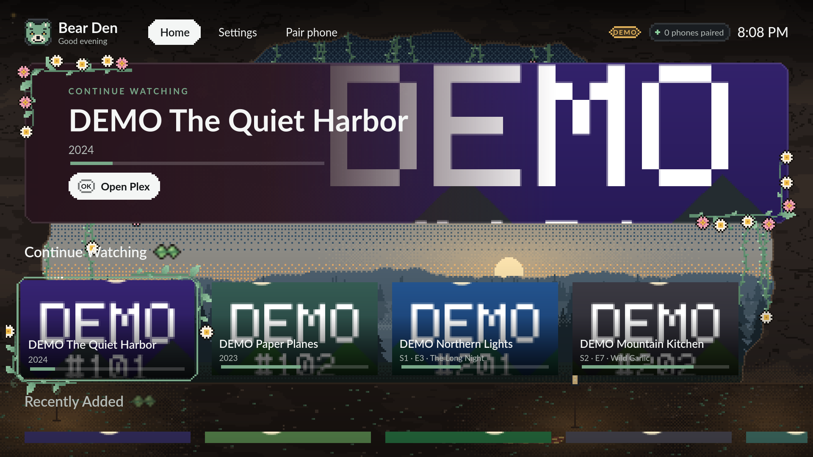
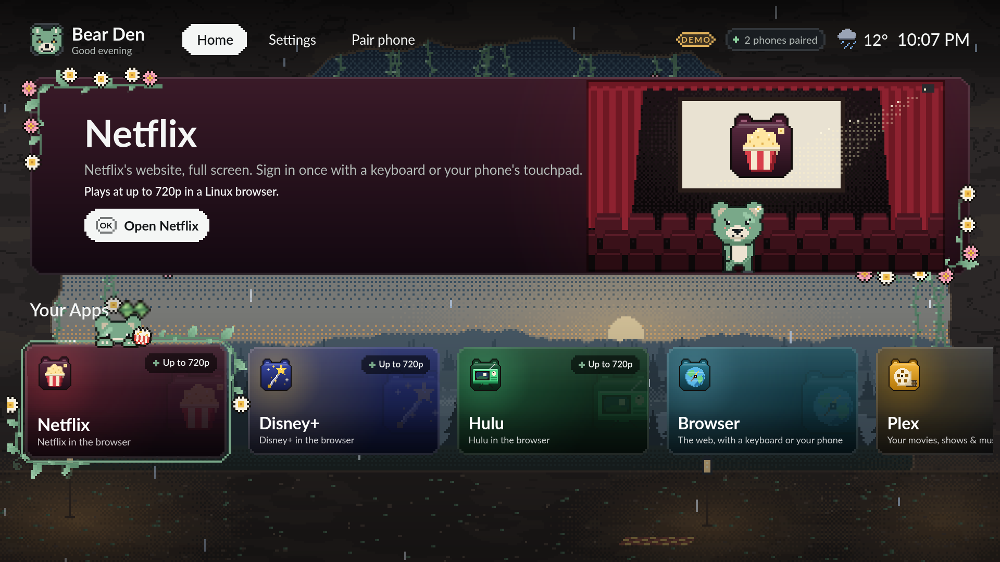
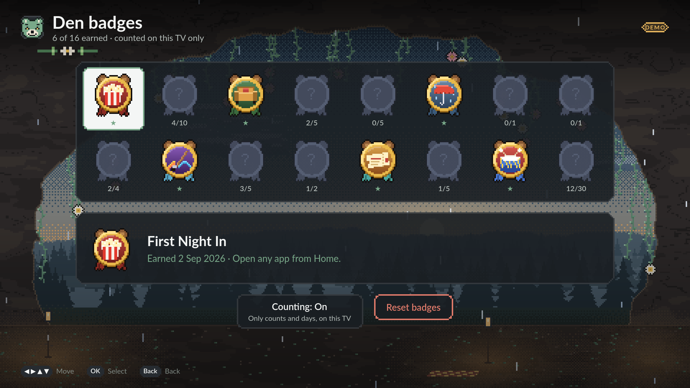
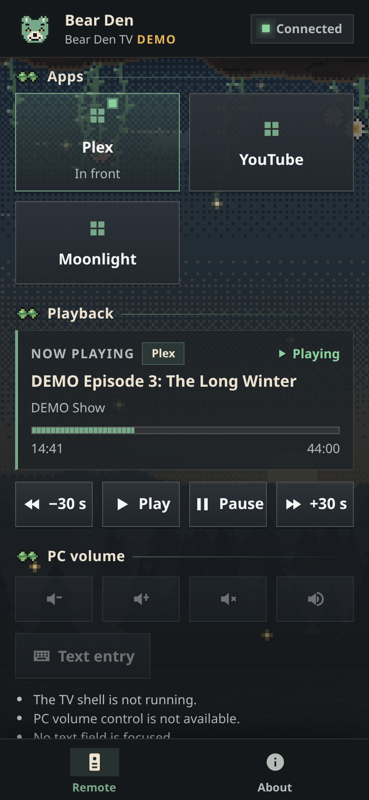

# Bear Den TV

[](https://github.com/itsgsimi/bear-den-tv/actions/workflows/ci.yml)

Bear Den TV turns a small Linux box into a TV that you drive with your phone.

- **A cosy home screen.** Big tiles for your apps on a pixel-art world (or a
  smooth Classic look), visiting bears, corner scenes that react to your local
  weather, and Den badges for little milestones. Five themes ship built in and
  your own are a folder away.
- **Your phone is the remote.** Pair it once with a code or QR on the TV; no
  app to install. It has a D-pad, a keyboard, a Now playing card, a sleep
  timer, and a touchpad for websites. Visitors get a guest pass that ends by
  itself.
- **Your apps, as they are.** Plex HTPC, VacuumTube (YouTube) and Moonlight,
  plus Spotify, Jellyfin Desktop and RetroArch when you install them. They are
  ordinary Flatpaks: Bear Den launches them, brings them to the front, tunes
  their playback for your box and always brings you back with Home. It never
  wraps, embeds or patches them. A missing app installs from Flathub with one
  press by the owner, per user and without root.
- **Streaming sites.** Netflix, Disney+ and Hulu (off until you turn them on)
  run full screen in Google Chrome from Flathub, each as its own app, and a
  Browser tile in Brave from Flathub, all driven by the remote (either
  browser can be swapped in Settings; streaming in Brave is marked
  unverified). A Linux browser caps them at about 720p.
- **Plex rows on Home.** Sign the TV in to Plex once and Home shows Continue
  Watching and Recently Added from your own server.
- **Optional extras.** Turn the TV on and off over HDMI-CEC (needs a CEC
  adapter), and turn the screen off with the sleep timer.


| | |
|---|---|
|  |  |
|  |  |
|  |  |



Screenshots are rendered on a workstation on demo data (the **DEMO** labels):
the TV pictures by the sandbox, the phone in a headless browser. None of them
was taken on a TV. The sandbox has no apps installed, so its tiles show Bear
Den's own icons; on a TV an installed app shows its own icon by default.

## Status: a working developer preview

It runs every day on one reference TV box. It is not a finished product. The
detailed, honest record is [`docs/IMPLEMENTATION_STATUS.md`](docs/IMPLEMENTATION_STATUS.md).
*Implemented*, *automatically tested* and *seen on the TV* are separate
claims there.

**Works, and has been seen on the reference TV:**

- The coordinator and home screen start at desktop login and restart after a crash.
- A phone pairs, then launches Plex HTPC, VacuumTube and Moonlight, sends keys,
  and returns Home with focus where you left it (end-to-end suite, 5/5).
- Everything is refused, with a reason, while the TV's desktop is locked.
- Deploying from a workstation with one script.
- Local weather fetched from Open-Meteo (the on-screen chip has not been checked
  by eye on the TV).

**Built and tested here, not yet seen on the TV** (automated tests, sandbox
screenshots, containers or fakes; nothing added since 2026-09-23 has run on
the TV):

- The pixel-art look and the Classic art style, the themes, bears, corner
  scenes and their reactions to the weather, and the featured panel's rooms.
- Plex sign-in on the TV and the Continue Watching and Recently Added rows
  (against a local fake of plex.tv and a server).
- Now playing on phones, the sleep timer and screen off, guest passes, Den
  badges.
- The optional apps (Spotify, Jellyfin Desktop, RetroArch), the app's own
  icons by default with Bear Den's as a choice, and one-press installs from
  Flathub with daily updates (tried in a container against real Flathub).
- Netflix, Disney+, Hulu in Google Chrome and the Browser in Brave, with the
  phone's touchpad (against local test pages in Playwright's Chromium only,
  never a real streaming site).
- TV control over HDMI-CEC (against a fake TV only).
- A Wayland profile (headless sway in a container only).
- The installable `.deb` (install/remove smoke tests in clean Ubuntu 22.04
  and 24.04 containers) and the GitHub Actions CI and release workflows
  (replayed step by step in a clean container). CI passes on GitHub: its
  first green run was on 2026-09-29 (commit `c8449a5`); the release workflow
  has not run there yet.

**Not done yet:**

- Checking the Plex rows against a real Plex account and server; opening the
  exact item in Plex HTPC (selecting a card opens Plex HTPC only).
- Playing a real streaming site in Google Chrome on the box (Hulu refused to
  play in Flathub Chromium on the TV, which is why Bear Den moved to Chrome),
  and the per-site navigation hints, are unverified.
- HDMI-CEC with a real adapter and TV.
- A published release: no release has been cut, and the package has not been
  installed on the TV.
- Browser (Playwright) tests for the phone remote (the web apps' navigation
  script has them), negative tests for the phone-facing HTTP/WebSocket server,
  and tests for `bear-den-tv doctor`.
- Remote keys into apps on Wayland.
- A kid mode (deferred).

## What it needs

| | |
|---|---|
| **TV box** | Linux with an **X11** desktop session (the reference box runs Linux Mint 21.3 Xfce). Wayland works in part: on sway and other wlroots compositors apps launch and Home works but remote keys do not reach apps; on GNOME and KDE the phone drives the home screen only ([ADR 0007](docs/decisions/0007-wayland-profile.md)). Wayland has been tested in a container, never on a real TV. |
| **Hardware floor** | A Celeron 2955U: 2 cores at 1.4 GHz, Haswell GT1 graphics, 7.6 GiB RAM, driving 1080p at 120 Hz. Faster boxes get more, from measured capability ([`docs/APP_PERFORMANCE.md`](docs/APP_PERFORMANCE.md)). |
| **Apps** | Flatpak (the owner installs it once with the system's package manager; Bear Den never does). Then any of Plex HTPC, VacuumTube and Moonlight (a missing one shows "Not installed" and installs on one press), optionally Spotify, Jellyfin Desktop and RetroArch (hidden until installed), and Google Chrome (Netflix, Disney+, Hulu) and Brave (the Browser tile) from Flathub. App installs go to the TV user's own Flatpak folder from Flathub, no root. |
| **Plex rows** (optional) | A Plex account and server, and a desktop keyring (Secret Service, for example gnome-keyring) for the TV's sign-in. |
| **HDMI-CEC** (optional) | A CEC device (`/dev/cec*`), usually a USB CEC adapter; most mini PCs have none ([`docs/operations.md`](docs/operations.md#tv-control-over-hdmi-cec)). |
| **Phone** | Any modern phone browser on the same network. No app to install. |
| **Workstation** | A Linux machine to build on. The toolchain installs in your home folder; no root needed. |

## Install

A `.deb` for Ubuntu 22.04 / Linux Mint 21.3 and newer (amd64, X11 desktop).
**No release has been published yet**, and the package has not been installed
on the reference TV. Until there is one, build a package yourself with the
toolchain below (`make package` → `build/dist/`), for your own use only
([why](docs/operations.md#cutting-a-release)). Releases will appear on the
[Releases page](https://github.com/itsgsimi/bear-den-tv/releases) as
`bear-den-tv_<version>_amd64.deb` with `SHA256SUMS`, built and tested by the
release workflow on GitHub's runner.

On the TV box:

```sh
sha256sum -c --ignore-missing SHA256SUMS            # optional: check the download
sudo apt install ./bear-den-tv_<version>_amd64.deb  # Qt is bundled; X11/EGL/fonts come from the distro
/usr/lib/bear-den-tv/start-session.sh --watch       # start it now, or open "Bear Den TV" from the app menu
bear-den-tv autostart enable                        # optional: start at every desktop login
```

Installing enables nothing by itself; autostart is your choice. To remove it:

```sh
bear-den-tv autostart disable
sudo apt remove --purge bear-den-tv
```

Your settings, paired phones, Den badges and the streaming sites' browser
profiles stay in `~/.config/bear-den-tv` and `~/.local/share/bear-den-tv`;
delete those to forget them. Apps Bear Den installed stay in your Flatpak
folder (`flatpak uninstall --user <id>` removes one). Details:
[`docs/operations.md` → Packaging](docs/operations.md#packaging).

## Quick start (on a workstation)

```sh
git clone <this repo> bear-den-tv && cd bear-den-tv
scripts/bootstrap-toolchain.sh      # once: Go, Qt 6.8, CMake, Node in ~/.bdtv-toolchain (no root)
. scripts/env.sh                    # every new shell: put the toolchain on PATH
make help                           # every make target
make test                           # Go (race), phone remote unit and browser tests, web-nav browser tests, shell tests (offscreen)
make dev DEV_ARGS=--dev-fixtures    # coordinator + home screen locally, fake desktop, DEMO data
```

Prototype the TV picture without a TV:

```sh
make shell                                                   # build the home screen
scripts/sandbox.sh shot --screen settings --theme forest     # one screenshot, prints its path
make shots                                                   # every theme × main screens in build/shots/gallery
```

## Run it on your TV

1. Copy [`target.env.example`](target.env.example) to `target.env` and set
   `BDTV_TARGET` to your TV's ssh address. `target.env` is untracked; never
   commit it.
2. Bootstrap the toolchain on the TV too (the home screen uses its Qt
   libraries): `scripts/target.sh run scripts/bootstrap-toolchain.sh`.
   The deploy script builds the TV shell to load Qt from the TV's own
   `~/.bdtv-toolchain`. If you bootstrapped it somewhere else on the TV, set
   `BDTV_TARGET_TOOLCHAIN` in `target.env`.
3. Deploy from the workstation: `scripts/deploy-target.sh` (try `--dry-run` first).
4. On the TV, start it once and turn on autostart:
   `scripts/start-session.sh --watch`, then `build/bin/bear-den-tv autostart enable`.
5. On the TV: **Settings → Phone remote**. Pick the network interface and agree
   to open it on your LAN. Nothing listens on the network before this.
6. **Pair phone** on the TV shows a QR code and a six-digit code. Open it on
   your phone.

The full, current commands are in [`docs/operations.md`](docs/operations.md).

## Make it yours

A theme is a package: a `theme.json` plus art, no code. Five ship built in
(Den, Forest, Campfire, Winter, Midnight). Your own go in
`~/.local/share/bear-den-tv/themes/` and appear without a rebuild. The bears
are the cast of the default style; **Themes → Style → Plain** turns them off.
**Themes → Art style** switches between Pixel and Classic, and **Settings →
App icons** between each app's own icon and Bear Den's drawings.
Start with [`docs/THEMES.md`](docs/THEMES.md).

## Repository map

| Part | Where | Owns | Guide |
|---|---|---|---|
| **Coordinator** (Go) | `cmd/`, `internal/` | the session: which app is in front, launching and closing apps, routing input, pairing and permissions, configuration, the LAN service, playback tuning | [`internal/AGENTS.md`](internal/AGENTS.md) |
| **TV shell** (Qt 6.8 QML/C++) | `apps/tv-shell/` | everything on the TV between apps: focus, screens, themes, bears | [`apps/tv-shell/AGENTS.md`](apps/tv-shell/AGENTS.md) |
| **Phone remote** (TypeScript, Preact) | `apps/remote-web/` | the phone UI, served by (and embedded in) the coordinator | [`apps/remote-web/AGENTS.md`](apps/remote-web/AGENTS.md) |
| **Web apps' navigation script** (TypeScript) | `apps/web-nav/` | D-pad control of websites in the web apps' browser, injected by the coordinator | [`apps/web-nav/AGENTS.md`](apps/web-nav/AGENTS.md) |
| **Contracts** | `contracts/` | JSON Schemas, specs and fixtures, validated in all three languages | [`contracts/AGENTS.md`](contracts/AGENTS.md) |
| **Themes** | `themes/` | theme packages (manifest + art, no code) | [`themes/AGENTS.md`](themes/AGENTS.md) |
| **Art tools** | `tools/pixelart/`, `tools/classicart/` | generate every bundled picture (worlds, bears, app icons, badges) | [`tools/pixelart/README.md`](tools/pixelart/README.md), [`tools/classicart/README.md`](tools/classicart/README.md) |
| **Packaging** | `packaging/`, `.github/workflows/` | the `.deb`, CI and the release workflow | [`docs/operations.md` → Packaging](docs/operations.md#packaging) |
| **Scripts** | `scripts/` | toolchain, sandbox, deploy, TV helpers | [`docs/operations.md`](docs/operations.md) |

## Docs map

| Question | Read |
|---|---|
| How does it all work? | [`docs/HOW_IT_WORKS.md`](docs/HOW_IT_WORKS.md) |
| What does this word mean? | [`docs/GLOSSARY.md`](docs/GLOSSARY.md) |
| Owner tasks, everyday commands, deploying, the TV | [`docs/operations.md`](docs/operations.md) |
| Themes and bears | [`docs/THEMES.md`](docs/THEMES.md) |
| App playback settings, box tiers | [`docs/APP_PERFORMANCE.md`](docs/APP_PERFORMANCE.md) |
| Security model | [`docs/security.md`](docs/security.md) |
| What is built, tested, seen on the TV | [`docs/IMPLEMENTATION_STATUS.md`](docs/IMPLEMENTATION_STATUS.md) |
| Why is it like this? | [`docs/decisions/`](docs/decisions/README.md) (ADRs) |
| Wire formats | [`contracts/README.md`](contracts/README.md) |
| How to change the code | [`AGENTS.md`](AGENTS.md), [`CONTRIBUTING.md`](CONTRIBUTING.md) |

## Contributing

Contributions from people and AI coding agents are welcome. Read
[`CONTRIBUTING.md`](CONTRIBUTING.md), then [`AGENTS.md`](AGENTS.md).

## License

MIT. See [`LICENSE`](LICENSE). Plex, YouTube, VacuumTube, Moonlight, Spotify,
Jellyfin, RetroArch, Netflix, Disney+, Hulu, Google Chrome and Brave are independent
projects and trademarks of their owners; Bear Den TV only launches them and
bundles none of their logos.
